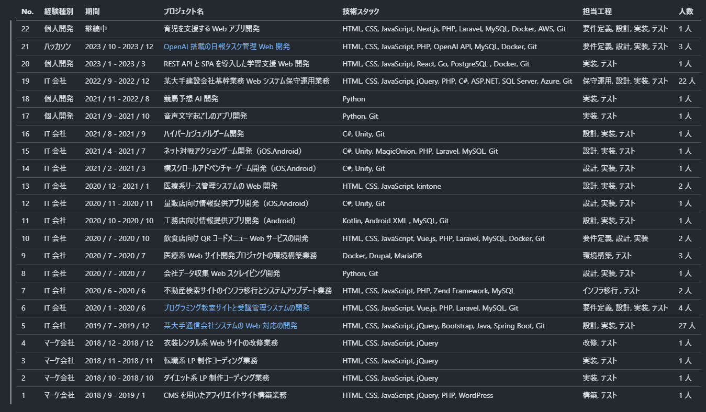

# プロジェクト経歴

| No. | 経験種別   | 期間                  | プロジェクト名                                                                                                    | 技術スタック                                                            | 担当工程                     | 人数  |
| --- | ---------- | --------------------- | ----------------------------------------------------------------------------------------------------------------- | ----------------------------------------------------------------------- | ---------------------------- | ----- |
| 22  | 個人開発   | 継続中                | 育児を支援する Web アプリ開発                                                                                     | HTML, CSS, JavaScript, Next.js, PHP, Laravel, MySQL, Docker, AWS, Git   | 要件定義, 設計, 実装, テスト | 1 人  |
| 21  | ハッカソン | 2023 / 10 - 2023 / 12 | [OpenAI 搭載の日報タスク管理 Web 開発](Details/20.OpenAI搭載の日報タスク管理Web開発.md)                           | HTML, CSS, JavaScript, PHP, OpenAI API, MySQL, Docker, Git              | 要件定義, 設計, 実装, テスト | 3 人  |
| 20  | 個人開発   | 2023 / 1 - 2023 / 3   | REST API と SPA を導入した学習支援 Web 開発                                                                       | HTML, CSS, JavaScript, React, Go, PostgreSQL , Docker, Git              | 実装, テスト                 | 1 人  |
| 19  | IT 会社    | 2022 / 9 - 2022 / 12  | 某大手建設会社基幹業務 Web システム保守運用業務                                                                   | HTML, CSS, JavaScript, jQuery, PHP, C#, ASP.NET, SQL Server, Azure, Git | 保守運用, 設計, 実装, テスト | 22 人 |
| 18  | 個人開発   | 2021 / 11 - 2022 / 8  | 競馬予想 AI 開発                                                                                                  | Python                                                                  | 実装, テスト                 | 1 人  |
| 17  | 個人開発   | 2021 / 9 - 2021 / 10  | 音声文字起こしのアプリ開発                                                                                        | Python, Git                                                             | 実装, テスト                 | 1 人  |
| 16  | IT 会社    | 2021 / 8 - 2021 / 9   | ハイパーカジュアルゲーム開発                                                                                      | C#, Unity, Git                                                          | 設計, 実装, テスト           | 1 人  |
| 15  | IT 会社    | 2021 / 4 - 2021 / 7   | ネット対戦アクションゲーム開発（iOS,Android）                                                                     | C#, Unity, MagicOnion, PHP, Laravel, MySQL, Git                         | 設計, 実装, テスト           | 1 人  |
| 14  | IT 会社    | 2021 / 2 - 2021 / 3   | 横スクロールアドベンチャーゲーム開発（iOS,Android）                                                               | C#, Unity, Git                                                          | 設計, 実装, テスト           | 1 人  |
| 13  | IT 会社    | 2020 / 12 - 2021 / 1  | 医療系リース管理システムの Web 開発                                                                               | HTML, CSS, JavaScript, kintone                                          | 設計, 実装, テスト           | 2 人  |
| 12  | IT 会社    | 2020 / 11 - 2020 / 11 | 量販店向け情報提供アプリ開発（iOS,Android）                                                                       | C#, Unity, Git                                                          | 設計, 実装, テスト           | 1 人  |
| 11  | IT 会社    | 2020 / 10 - 2020 / 10 | 工務店向け情報提供アプリ開発（Android）                                                                           | Kotlin, Android XML , MySQL, Git                                        | 設計, 実装, テスト           | 1 人  |
| 10  | IT 会社    | 2020 / 7 - 2020 / 10  | 飲食店向け QR コードメニュー Web サービスの開発                                                                   | HTML, CSS, JavaScript, Vue.js, PHP, Laravel, MySQL, Docker, Git         | 要件定義, 設計, 実装         | 2 人  |
| 9   | IT 会社    | 2020 / 7 - 2020 / 7   | 医療系 Web サイト開発プロジェクトの環境構築業務                                                                   | Docker, Drupal, MariaDB                                                 | 環境構築, テスト             | 3 人  |
| 8   | IT 会社    | 2020 / 7 - 2020 / 7   | 会社データ収集 Web スクレイピング開発                                                                             | Python, Git                                                             | 設計, 実装, テスト           | 1 人  |
| 7   | IT 会社    | 2020 / 6 - 2020 / 6   | 不動産検索サイトのインフラ移行とシステムアップデート業務                                                          | HTML, CSS, JavaScript, PHP, Zend Framework, MySQL                       | インフラ移行 , テスト        | 2 人  |
| 6   | IT 会社    | 2020 / 1 - 2020 / 6   | [プログラミング教室サイトと受講管理システムの開発](Details/6.プログラミング教室サイトと受講管理システムの開発.md) | HTML, CSS, JavaScript, Vue.js, PHP, Laravel, MySQL, Git                 | 要件定義, 設計, 実装, テスト | 4 人  |
| 5   | IT 会社    | 2019 / 7 - 2019 / 12  | [某大手通信会社システムの Web 対応の開発](Details/5.某大手通信会社システムのWeb対応の開発.md)                     | HTML, CSS, JavaScript, jQuery, Bootstrap, Java, Spring Boot, Git        | 設計, 実装, テスト           | 27 人 |
| 4   | マーケ会社 | 2018 / 12 - 2018 / 12 | 衣装レンタル系 Web サイトの改修業務                                                                               | HTML, CSS, JavaScript, jQuery                                           | 改修, テスト                 | 1 人  |
| 3   | マーケ会社 | 2018 / 11 - 2018 / 11 | 転職系 LP 制作コーディング業務                                                                                    | HTML, CSS, JavaScript, jQuery                                           | 実装, テスト                 | 1 人  |
| 2   | マーケ会社 | 2018 / 10 - 2018 / 10 | ダイエット系 LP 制作コーディング業務                                                                              | HTML, CSS, JavaScript, jQuery                                           | 実装, テスト                 | 1 人  |
| 1   | マーケ会社 | 2018 / 9 - 2019 / 1   | CMS を用いたアフィリエイトサイト構築業務                                                                          | HTML, CSS, JavaScript, jQuery, PHP, WordPress                           | 構築, テスト                 | 1 人  |
